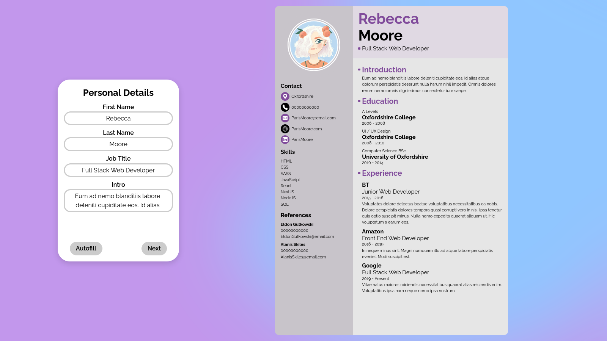
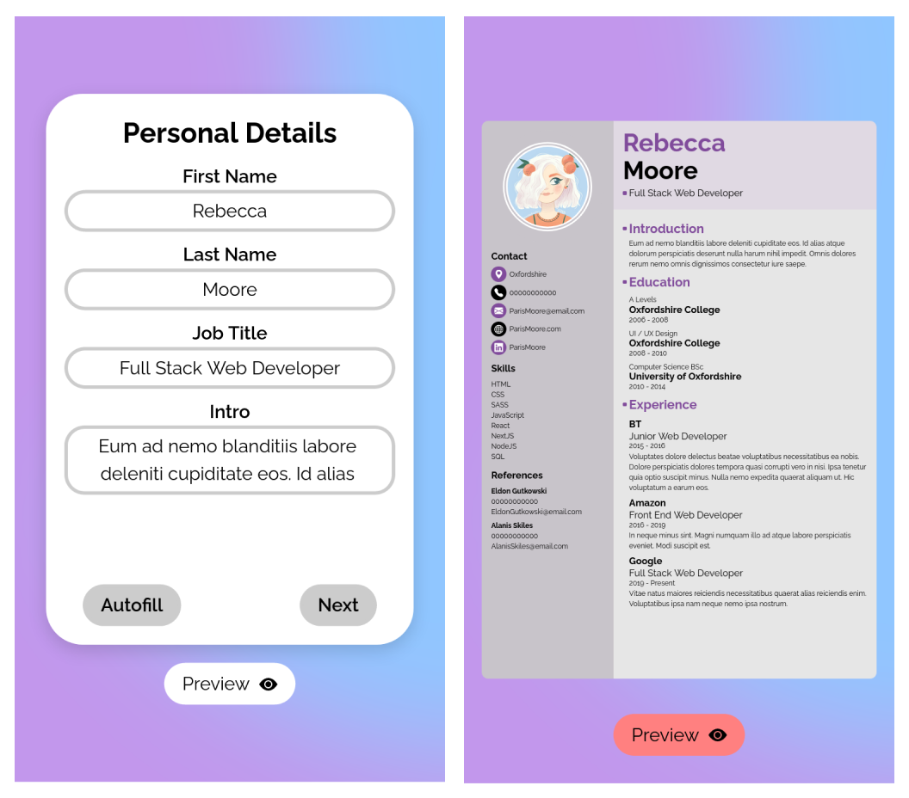

	<h1>CV Application
	 
		
		
		 
	</h1>
	<h3><b><a href="https://clarasmyth.github.io/cv-application/">View Live Demo</a></b></h3>

## Description

This project was bootstrapped with [Create React App](https://github.com/facebook/create-react-app).

This project is a CV builder application created as part of [TheOdinProject](https://www.theodinproject.com) curriculum.

To see the assignment details - [Click Here](https://www.theodinproject.com/lessons/node-path-javascript-cv-application)

## Built Using

- React 
- SASS 

#### Other tools used

- ESLint 
- Prettier 

## Credits

#### Packages/Libraries

- [React Zoom Pan Pinch](https://github.com/proNestorAps/react-zoom-pan-pinch)
- [React Avatar Editor](https://github.com/mosch/react-avatar-editor)
- [Dom To Image](https://github.com/tsayen/dom-to-image)
- [File Saver](https://github.com/eligrey/FileSaver.js)
- [Faker JS](https://github.com/faker-js/faker)

#### Icons

- [React Icons](https://github.com/react-icons/react-icons)
- [Bootstrap Icons](https://github.com/twbs/icons)

#### Favicon

- [favicon.io](https://favicon.io/)

## Gallery

### Desktop

### Mobile

